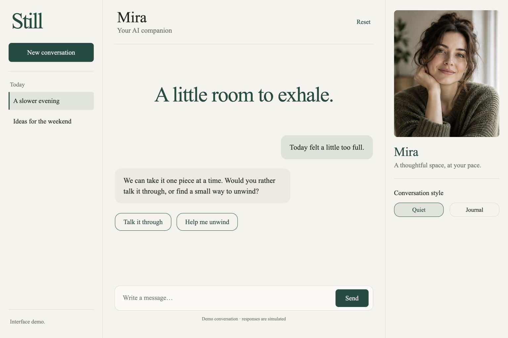
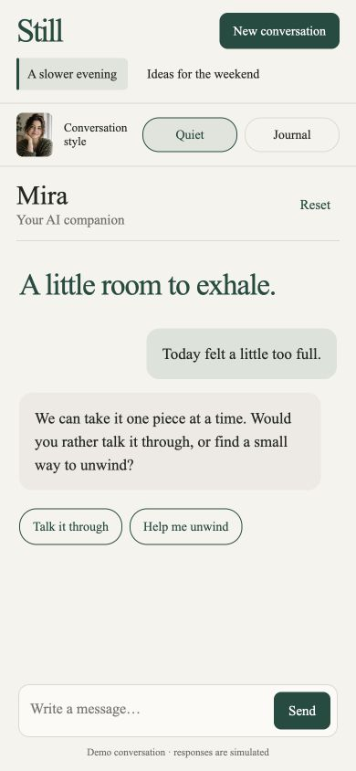

# Still — Responsive Conversation UI Template

A calm conversation interface for frontend prototypes and client demos, built with plain HTML, CSS and JavaScript.

**[Try the live demo](https://moyuziya.github.io/still-conversation-ui-preview/)** · **[Get the template package and commercial-use license — $12](https://moyuziya.gumroad.com/l/xfjci?utm_source=github&utm_medium=portfolio&utm_campaign=still_launch)**

## What you can customize

- Responsive desktop and mobile layouts
- Quiet and Journal conversation modes
- Suggested prompts, new/switch conversation and reset controls
- Send/cancel interactions, keyboard focus styles and reduced-motion support

## What is included in the paid download

Editable source, a fictional adult portrait, desktop and mobile screenshots, setup instructions, and a license for personal and commercial end products including client projects. Standalone template resale is excluded.

Replies are simulated locally. This is a frontend template: no real AI model, backend, login, database, persistent storage or deployment is included. Conversations reset on refresh.

## Mobile preview

## Provenance and support

Created with Codex assistance and an AI-generated fictional adult portrait. No exclusive rights in that generated image are promised. These are actual browser screenshots of the delivered template.

For a scoped customization inquiry, open an issue describing the desired screen or interaction. Price and delivery timing will be agreed before work begins. Please do not post credentials or private customer data.

This repository is a public product preview. The browser demo code is publicly visible for evaluation. The paid download supplies the packaged files, setup instructions, and personal/commercial end-product usage permission described on the product page. This preview repository does not grant a commercial-use or standalone redistribution license.
